# Execution Pipeline & Flow

## 🔄 Complete Backtest Flow

```mermaid
graph TD
    A[User: python backtest.py] --> B[Phase 1: Configuration]
    B --> C[Phase 2: Data Preparation]
    C --> D[Phase 3: Engine Initialization]
    D --> E[Phase 4: Backtest Loop]
    E --> F[Phase 5: Post-Processing]
    F --> G[Phase 6: Output & Visualization]
    G --> H[✅ Backtest Completed]
    
    C --> C1[Per each symbol]
    C1 --> C2[Load 1m Parquet]
    C1 --> C3[Resample to Strategy TF]
    C1 --> C4[Calculate/Retrieve Indicators]
    
    E --> E1[Entry Check]
    E --> E2[Exit Check]
    E --> E3[Journal Writing]
```



## ⏱️ Phase 1: Configuration

### Input Processing
```python
# backtest.py
config = load_config('config.yaml')  # Validates and loads configuration

# Key validations:
1. Strategy timeframe is supported (1m, 5m, 15m, 30m, 1h, 2h, 3h, 4h, 6h, 8h, 12h, 1d)
2. Required strategy files exist
3. Data files exist in data/raw/
4. All indicator calculators are available
```

### Configuration Structure
```yaml
# config.yaml
backtest:
  period:
    start: "2026-01-10"    # Filter applied after loading
    end: "2026-01-22"
  capital:
    initial: 10000
  costs:
    commission: 0.001      # Applied on both entry and exit

data:
  symbols: ["XPLUSDT"]     # Single or multi-asset
  timeframe: "1m"          # Always 1m for raw data
  source_dir: "data/raw"
  source_file: "XPLUSDT-1m-2025-2026-01-22"

strategy:
  timeframe: "4h"          # Controls everything! 🎯
  # Entry, exit, risk configurations...

indicators:
  - name: "sma"
    params: {period: 200}
    column: "sma_200"      # Reference name
```

## 📊 Phase 2: Data Preparation (Per Symbol)

### Step 1: Load Raw 1-Minute Data
```python
# data_loader.py
def load_data(symbol, config):
    file_path = f"{config['data']['source_dir']}/{config['data']['source_file']}.parquet"
    df = pd.read_parquet(file_path)
    
    # Apply date filtering
    mask = (df.index >= config['backtest']['period']['start']) & \
           (df.index <= config['backtest']['period']['end'])
    df = df[mask].copy()
    
    return df  # DataFrame with OHLCV columns, 1m resolution
```

### Step 2: Resample to Strategy Timeframe
**BREAKING CHANGE: Multi-TF System**

```python
# indicator_manager.py
def resample_to_timeframe(df_1m, target_tf):
    """
    Resamples 1-minute data to target strategy timeframe.
    
    Example: strategy.timeframe = "4h"
    - Converts 1m → 4h candles
    - Uses proper OHLC aggregation
    - Forward-fills for indicator alignment
    """
    tf_map = {
        "1m": "1T", "5m": "5T", "15m": "15T", "30m": "30T",
        "1h": "1h", "2h": "2h", "3h": "3h", "4h": "4h",
        "6h": "6h", "8h": "8h", "12h": "12h", "1d": "1D"
    }
    
    resample_rule = tf_map[target_tf]
    
    # Resample OHLCV with proper aggregation
    df_resampled = df_1m.resample(resample_rule, label='left', closed='left').agg({
        'open': 'first',
        'high': 'max',
        'low': 'min',
        'close': 'last',
        'volume': 'sum'
    }).dropna()
    
    return df_resampled
```

### Step 3: Calculate/Retrieve Indicators
**Intelligent Caching with Timeframe Support**

```python
# indicator_manager.py
def get_indicator(symbol, indicator_name, params, timeframe):
    """
    Get indicator from cache or calculate.
    
    Cache key includes timeframe:
    - sma_period200_1h_1m_hash.parquet
    - sma_period200_4h_1m_hash.parquet
    """
    # Generate cache key
    cache_key = f"{indicator_name}_{params_str}_{timeframe}"
    cache_path = f"data/indicators/{symbol}/{cache_key}.parquet"
    
    if os.path.exists(cache_path):
        # Load from cache (instant)
        return pd.read_parquet(cache_path)
    else:
        # Calculate on resampled data
        calculator = get_calculator(indicator_name)
        calculator.timeframe = timeframe
        
        # Note: 'data' here is the RESAMPLED data (e.g., 4h)
        values = calculator.calculate(resampled_data, params)
        
        # Forward-fill to 1m for alignment
        values_1m = values.reindex(df_1m.index, method='ffill')
        
        # Save to cache
        values_1m.to_parquet(cache_path)
        
        return values_1m
```

### Step 4: Merge All Data
```python
# Final DataFrame structure:
# Index: 1-minute timestamps (for consistent loop)
# Columns:
#   - OHLCV (1m original)
#   - indicator_1 (forward-filled from strategy TF)
#   - indicator_2 (forward-filled from strategy TF)
#   - ... all configured indicators
```

## ⚙️ Phase 3: Engine Initialization

### Engine State
```python
# engine.py
class BacktestEngine:
    def __init__(self, config, data, entry_strategy, exit_strategy, risk_manager):
        self.config = config
        self.data = data  # Complete dataset with indicators
        self.entry_strategy = entry_strategy
        self.exit_strategy = exit_strategy
        self.risk_manager = risk_manager
        
        # State variables
        self.capital = config['backtest']['capital']['initial']
        self.position = None  # {'type': 'long', 'entry_price': ..., 'entry_time': ...}
        self.trades = []
        self.equity_curve = []
        
        # Journal writer
        self.journal = JournalWriter(config)
```

## 🔁 Phase 4: Backtest Loop

### Timeline Alignment
**Important:** The loop runs on **1-minute bars** but strategies operate on **strategy timeframe logic**.

```python
# engine.py
def run(self):
    # DataWindow provides sliding window access
    window = DataWindow(self.data, window_size=100)
    
    for i in range(len(self.data)):
        # Update window to current position
        window.update(i)
        
        current_time = self.data.index[i]
        
        # Check if this is a "strategy bar" (aligned with strategy TF)
        is_strategy_bar = self._is_strategy_bar(current_time)
        
        if not self.position and is_strategy_bar:
            # === ENTRY CHECK ===
            if self.entry_strategy.should_enter(window):
                self._enter_position(window, current_time)
        
        elif self.position:
            # === EXIT CHECK ===
            should_exit, reason = self.exit_strategy.should_exit(
                window, 
                self.position['entry_price'],
                self.position['entry_time'],
                self.position['type']
            )
            
            if should_exit:
                self._exit_position(window, current_time, reason)
        
        # === JOURNAL WRITING (every bar) ===
        self.journal.write(
            timestamp=current_time,
            price=window['close'][0],
            entry_signal=entry_signal,
            exit_signal=exit_signal,
            position=self.position,
            capital=self.capital,
            indicators={name: window[name][0] for name in indicator_names}
        )
```

### Entry Execution Flow
```python
def _enter_position(self, window, timestamp):
    """
    Execute entry with risk management
    """
    # 1. Get entry price (current close)
    entry_price = window['close'][0]
    
    # 2. Calculate stop loss (from exit strategy)
    sl_price = self.exit_strategy.get_stop_loss_price(
        entry_price, 
        self.position_type
    )
    
    # 3. Calculate position size (risk manager)
    position_size = self.risk_manager.calculate_position_size(
        capital=self.capital,
        entry_price=entry_price,
        stop_loss_price=sl_price,
        position_type=self.position_type
    )
    
    # 4. Apply commissions
    commission = position_size * entry_price * self.config['costs']['commission']
    self.capital -= commission
    
    # 5. Update state
    self.position = {
        'type': self.position_type,
        'entry_price': entry_price,
        'entry_time': timestamp,
        'size': position_size,
        'stop_loss': sl_price
    }
    
    # 6. Log trade
    self.trades.append({
        'entry_time': timestamp,
        'entry_price': entry_price,
        'size': position_size,
        'type': self.position_type
    })
```

### Exit Execution Flow
```python
def _exit_position(self, window, timestamp, reason):
    """
    Execute exit and calculate P&L
    """
    # 1. Get exit price
    exit_price = window['close'][0]
    
    # 2. Calculate P&L
    position = self.position
    if position['type'] == 'long':
        pnl = (exit_price - position['entry_price']) * position['size']
    else:  # short
        pnl = (position['entry_price'] - exit_price) * position['size']
    
    # 3. Apply commissions
    commission = position['size'] * exit_price * self.config['costs']['commission']
    pnl -= commission
    
    # 4. Update capital
    self.capital += pnl
    
    # 5. Complete trade record
    trade = self.trades[-1]  # Last entry
    trade.update({
        'exit_time': timestamp,
        'exit_price': exit_price,
        'pnl': pnl,
        'pnl_pct': pnl / (position['entry_price'] * position['size']),
        'exit_reason': reason,
        'commission': commission
    })
    
    # 6. Clear position
    self.position = None
```

## 📈 Phase 5: Post-Processing

### Trade Analysis
```python
# metrics_calculator.py
def calculate_metrics(trades, equity_curve):
    """
    Calculate comprehensive performance metrics
    """
    metrics = {
        # Returns
        'total_return_pct': (equity_curve[-1] / equity_curve[0] - 1) * 100,
        'annual_return_pct': ...,
        
        # Risk
        'max_drawdown_pct': ...,
        'sharpe_ratio': ...,
        'sortino_ratio': ...,
        'calmar_ratio': ...,
        
        # Trade statistics
        'total_trades': len(trades),
        'win_rate_pct': ...,
        'profit_factor': ...,
        'avg_win_pct': ...,
        'avg_loss_pct': ...,
        
        # Ratios
        'win_loss_ratio': ...,
        'expectancy': ...,
        
        # Time-based
        'avg_trade_duration': ...,
        'longest_drawdown_duration': ...
    }
    
    return metrics
```

### Consistency Checks
```python
def verify_calculations(journal_df, trades):
    """
    Automated verification of all calculations
    """
    checks = []
    
    # 1. Capital never negative
    checks.append(journal_df['capital'].min() >= 0)
    
    # 2. Position size matches risk rules
    for trade in trades:
        expected_size = risk_manager.calculate_position_size(...)
        checks.append(abs(trade['size'] - expected_size) < 0.001)
    
    # 3. Equity curve matches trades
    calculated_equity = reconstruct_equity_from_trades(trades)
    checks.append(np.allclose(journal_df['equity'], calculated_equity))
    
    # 4. No data gaps
    time_diff = journal_df.index.to_series().diff()
    checks.append((time_diff == pd.Timedelta('1min')).all())
    
    return all(checks)
```

## 🎨 Phase 6: Output & Visualization

### File Structure
```
data/journals/XPLUSDT_4h_sma_cross_20260122_143022/
├── journal.parquet           # Tick-by-tick log (1m bars)
├── trades.parquet            # Trade list with P&L
├── metrics.json              # Performance metrics
│
├── equity_curve.png          # Capital over time
├── drawdown_chart.png        # Drawdown visualization
├── price_signals.png         # Price + indicators + signals
├── returns_distribution.png  # P&L histogram
│
├── summary.txt               # Human-readable summary
└── config_used.yaml          # Configuration snapshot
```

### Journal Columns (journal.parquet)
```python
# Each row = 1-minute bar
columns = [
    'timestamp',           # 1-minute timestamp
    'symbol',              # Asset symbol
    'open', 'high', 'low', 'close', 'volume',  # Original 1m data
    
    # Strategy signals
    'entry_signal',        # True if entry condition met
    'exit_signal',         # True if exit condition met
    'in_position',         # Boolean
    'position_type',       # 'long', 'short', or None
    'position_size',       # Current position size
    
    # Account state
    'capital',             # Current capital
    'equity',              # Capital + unrealized P&L
    'drawdown_pct',        # Current drawdown
    
    # Indicator values (forward-filled from strategy TF)
    'sma_200',             # SMA 200 on 4h data (aligned to 1m)
    'rsi_14',              # RSI 14 on 4h data
    # ... all configured indicators
    
    # Trade info (if in position)
    'entry_price',         # Price when entered
    'entry_time',          # When position was opened
    'unrealized_pnl',      # Current P&L
    'unrealized_pnl_pct',  # Current P&L %
]
```

### Visualization Pipeline
```python
# reports/plotter.py
def create_all_plots(journal_df, trades, config):
    """
    Generate all visualizations
    """
    # 1. Resample for plotting (1m → strategy TF for clarity)
    plot_tf = config['strategy']['timeframe']
    plot_df = resample_for_plotting(journal_df, plot_tf)
    
    # 2. Equity curve with drawdown
    fig1 = plot_equity_curve(plot_df)
    
    # 3. Price chart with signals
    fig2 = plot_price_signals(
        plot_df,
        indicators=['sma_200', 'bollinger_upper', 'bollinger_lower'],
        entry_signals=journal_df['entry_signal'],
        exit_signals=journal_df['exit_signal']
    )
    
    # 4. Trade analysis
    fig3 = plot_trade_analysis(trades)
    
    # 5. Returns distribution
    fig4 = plot_returns_distribution(trades)
    
    return [fig1, fig2, fig3, fig4]
```

## ⏱️ Performance Timeline

### First Execution (Everything Calculated)
```
T+0s: python backtest.py
T+1s: Config loaded ✓
T+2s: Raw 1m data loaded (525k candles) ✓
T+3s: Resampling to 4h... ✓
T+4s: Calculating indicators on 4h data... (SMA, RSI, ATR)
T+20s: Indicators cached ✓
T+21s: Starting backtest loop...
T+40s: [===============>] 100% (13,000 candles/sec)
T+41s: Calculating metrics...
T+42s: Generating plots...
T+45s: ✅ Backtest completed! (45 seconds total)
```

### Subsequent Execution (Everything Cached)
```
T+0s: python backtest.py
T+1s: Config loaded ✓
T+2s: Raw 1m data loaded ✓
T+2.1s: Resampled 4h data from cache ✓
T+2.2s: All indicators from cache ✓
T+2.3s: Starting backtest loop...
T+4.3s: Loop completed (2 seconds for 525k candles)
T+4.5s: Metrics calculated ✓
T+5.0s: Plots generated ✓
T+5.5s: ✅ Backtest completed! (5.5 seconds total)
```

## 🚨 Error Handling & Recovery

### Common Issues
```python
# Data file not found
if not os.path.exists(data_path):
    raise FileNotFoundError(
        f"Data file not found: {data_path}\n"
        f"Please ensure 1m Parquet files are in {config['data']['source_dir']}/"
    )

# Indicator calculator not found
try:
    calculator = get_calculator(indicator_name)
except KeyError:
    raise ValueError(
        f"Indicator calculator '{indicator_name}' not found.\n"
        f"Create file: indicators/{indicator_name}_calculator.py"
    )

# Cache corruption
try:
    cached_data = pd.read_parquet(cache_path)
except Exception as e:
    logger.warning(f"Cache corrupted, recalculating: {cache_path}")
    os.remove(cache_path)
    # Recalculate and cache again
```

### Validation Steps
1. **Pre-flight check**: Verify all files and modules exist
2. **Data validation**: Check for NaN, gaps, reasonable values
3. **Calculation verification**: Compare key calculations manually
4. **Output validation**: Ensure all output files are created

## 📈 Scalability Considerations

### Multi-Asset Support
```yaml
# config.yaml
data:
  symbols: ["BTCUSDT", "ETHUSDT", "SOLUSDT"]  # Multiple assets
```

Processing flow:
```python
# Parallel processing (future enhancement)
with ThreadPoolExecutor() as executor:
    futures = []
    for symbol in symbols:
        future = executor.submit(run_backtest_for_symbol, symbol, config)
        futures.append(future)
    
    results = [f.result() for f in futures]
    
# Portfolio aggregation
portfolio_results = aggregate_portfolio_results(results)
```

### Large Dataset Optimization
1. **Chunked processing**: Process data in chunks for memory efficiency
2. **Incremental caching**: Cache indicators as they're calculated
3. **Parallel calculation**: Calculate independent indicators in parallel
4. **Selective loading**: Load only required date ranges

---

**Next**: Understand the multi-timeframe system in detail: [Multi-TF System Guide](multitf-system.md)

**Related**: Learn how to write custom components: [Components Guide](components.md)
